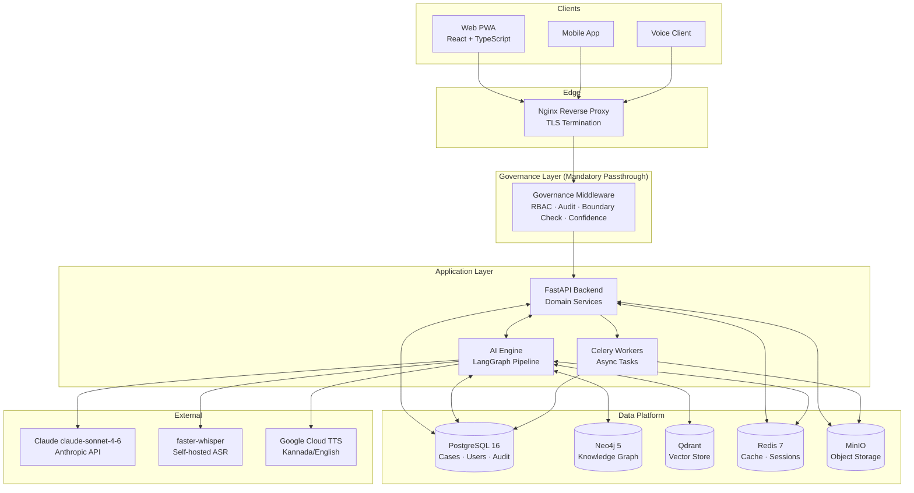
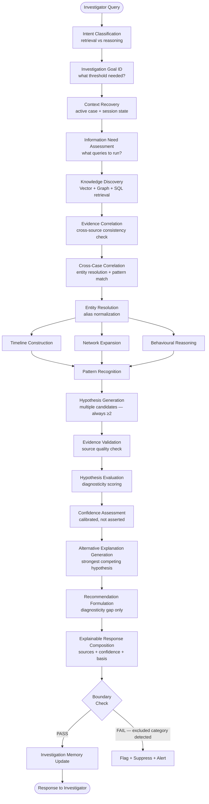
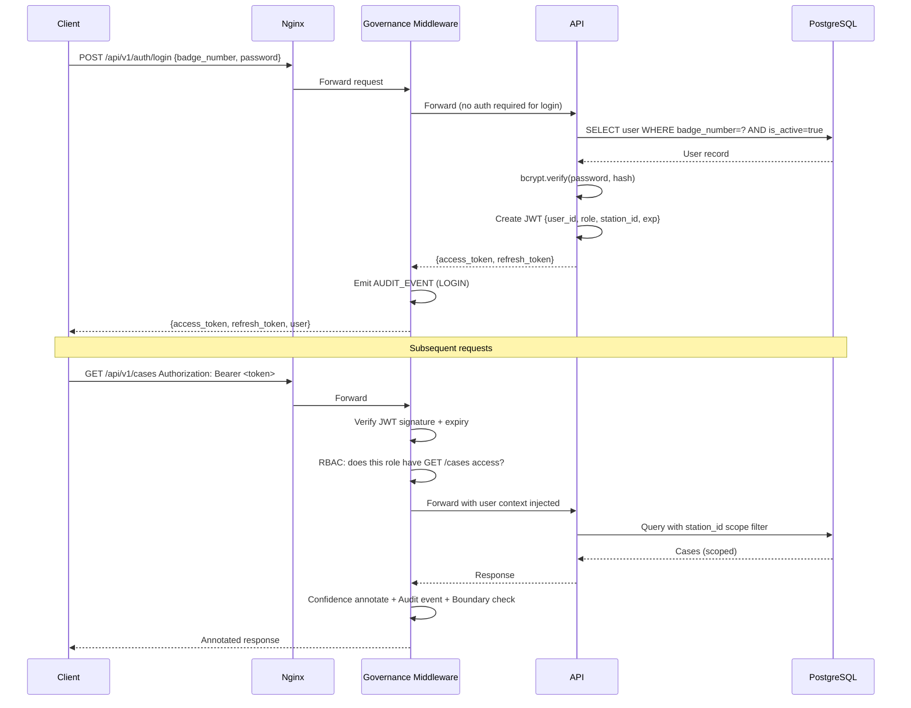
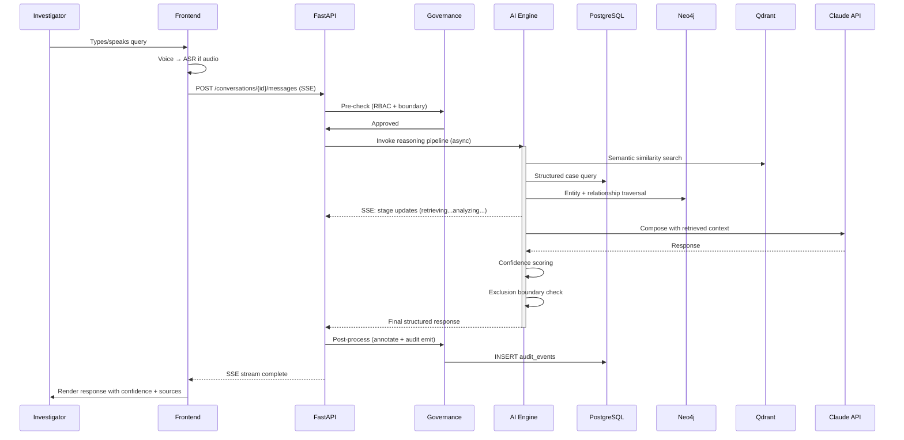
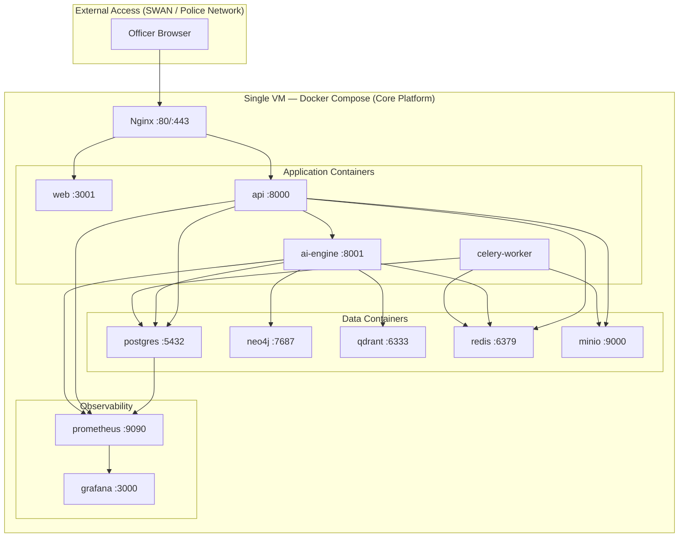

# Engineering Implementation Blueprint
## Challenge 01 — KSP Crime Intelligence Platform

**Version:** 1.0
**Status:** Final engineering decisions — this document supersedes all prior architectural discussions on implementation specifics

---

### Scope note

This blueprint is organized into three delivery phases driven by **engineering dependencies and governance readiness**, not calendar schedules. Phase 1 (Core Platform) delivers core conversational intelligence, cross-case resolution, and the full governance substrate. Phase 2 adds network visualization, timeline, and statistically-validated behavioral linkage. Phase 3 adds the Aggregate Intelligence domain (hotspot forecasting, structural context) — gated on demonstrated Phase 1 governance maturity and mandatory external legal/ethics review.

Infrastructure concerns deferred to Phase 1 production deployment (Karnataka SDC, HSM-backed key management, NIC DR node, HMAC audit-log chains) are documented in Section 7.8. The governance principles — no person-level risk scoring, no demographic inference, structural audit trail — are implemented from the first working build, not added later.

All prior phases' hard exclusions (demographic/person-level risk categories) are enforced in code, not by convention.

---

## SECTION 1 — Executive Product Experience

### 1.1 Product philosophy (implementation expression)

The platform's single visual identity is: **"a capable analyst sitting beside you."** Every screen either surfaces the conversation (where reasoning happens) or provides a reference view (network, timeline, map) that the conversation can launch. There is no screen that is "just a dashboard." Every view is navigable from a question.

### 1.2 Navigation Hierarchy

```
KSP Crime Intelligence Platform
├── Investigation Workspace (default landing — conversation + results)
├── Search (cross-case search)
├── Network (knowledge graph explorer)
├── Crime Map (spatial/hotspot view)
├── Cases (case directory)
├── Profiles (entity/suspect profiles)
├── Reports (generated products)
├── Alerts (early warnings)
└── Administration (admin/auditor only)
```

### 1.3 Screen: Login

**Purpose:** Authenticate + establish role context before any data is accessed.

```
┌─────────────────────────────────────────────────────────┐
│                KSP Crime Intelligence Platform           │
│                  ─────────────────────                  │
│                                                         │
│              ┌───────────────────────────┐              │
│              │   Badge / Employee ID      │              │
│              └───────────────────────────┘              │
│              ┌───────────────────────────┐              │
│              │   Password                │              │
│              └───────────────────────────┘              │
│                                                         │
│              ┌───────────────────────────┐              │
│              │  SIGN IN                  │              │
│              └───────────────────────────┘              │
│                                                         │
│              Karnataka State Police | SCRB              │
└─────────────────────────────────────────────────────────┘
```
**Components:** Badge ID input, password input, submit button. **Actions:** Authenticate; on success, redirect to Investigation Workspace. **AI interaction:** None. **Role enforcement:** JWT returned contains role + station scope; every subsequent API call uses this token.

---

### 1.4 Screen: Investigation Workspace (Primary Screen)

**Purpose:** The core investigative experience — natural-language conversation + live context panel. This is the default view for all investigative roles.

```
┌──────────────────────────────────────────────────────────────────────┐
│ [≡] KSP Intel Platform  |  [Case: CR-2024-04471 ▼]  |  [EN/ಕನ್ನಡ]  [●User] │
├──────────┬──────────────────────────────────────┬────────────────────┤
│          │                                      │  CASE CONTEXT      │
│  [🏠]    │  CONVERSATION                        │  ─────────────     │
│  Home    │  ─────────────────────────────────   │  CR-2024-04471     │
│          │                                      │  Type: Robbery     │
│  [🔍]    │  ┌─────────────────────────────────┐ │  Status: Active    │
│  Search  │  │ AI  Has this MO appeared else-  │ │  IO: SI Ravi K.    │
│          │  │     where in Karnataka in 2024?  │ │                    │
│  [🕸️]    │  │     ─────────────────────────   │ │  LIVE HYPOTHESES   │
│  Network │  │     3 similar cases found.      │ │  ─────────────     │
│          │  │     CR-2023-11201 (Tumkur)      │ │  H1: Known         │
│  [🗺️]    │  │     CR-2024-00892 (Mysuru)      │ │  recidivist ●●●○○  │
│  Map     │  │     CR-2024-03107 (Bengaluru)   │ │                    │
│          │  │     Confidence: Moderate         │ │  H2: Organised     │
│  [📁]    │  │     Sources: [IIF-1 records]    │ │  group  ●●○○○      │
│  Cases   │  │     [Expand reasoning ▼]        │ │                    │
│          │  └─────────────────────────────────┘ │  [+ Add note]      │
│  [👤]    │                                      │                    │
│  Profiles│  ┌─────────────────────────────────┐ │  OPEN QUESTIONS    │
│          │  │ You Show me the network for     │ │  ─────────────     │
│  [📋]    │  │     suspect Raju K.             │ │  • Weapon source   │
│  Reports │  └─────────────────────────────────┘ │  • 3rd associate   │
│          │                                      │                    │
│  [🔔]    │  [← Timeline] [Network ↗] [Map ↗]   │                    │
│  Alerts  │                                      │                    │
│          │  ┌──────────────────────────────────┐│                    │
│  [⚙️]    │  │ 🎤  Ask anything about this case ││                    │
│  Admin   │  │     (English or ಕನ್ನಡ)           ││                    │
│          │  └──────────────────────────────────┘│                    │
└──────────┴──────────────────────────────────────┴────────────────────┘
```

**Components:** Persistent left nav; case selector (top); conversation thread (center); case context + hypothesis panel (right); query input with language toggle and voice button (bottom).

**User actions:** Type or speak a query; expand AI reasoning trace; click "Network ↗" to open network view seeded with conversation context; click "Timeline ↗" to open timeline view; add a personal hypothesis note.

**AI interaction:** Every AI response shows confidence level (●●●○○ = Moderate), inline source citations, and an "Expand reasoning" affordance for the full trace. Conflicting evidence surfaces as a yellow-highlighted block distinct from normal answers.

**Navigation:** Left nav icons collapse to icons-only on smaller screens. Case context panel collapses to a tab on tablet.

---

### 1.5 Screen: Criminal / Entity Profile

**Purpose:** Consolidated view of everything known about a specific person, vehicle, or organization.

```
┌──────────────────────────────────────────────────────────────────────┐
│ [←] Profiles  >  Raju Kumar (Person)                    [Export PDF] │
├──────────────────────────────┬───────────────────────────────────────┤
│  IDENTITY                    │  NETWORK PREVIEW (mini graph)         │
│  ──────────────────────      │  ╔════════════════════════════════╗   │
│  Canonical: Raju Kumar       │  ║  [Suresh]──(ASSOCIATE)──[Raju] ║   │
│  Aliases: Raja K, Raju Sh,   │  ║       └──(ACCUSED_IN)──[Case] ║   │
│           ರಾಜು ಕುಮಾರ         │  ╚════════════════════════════════╝   │
│  DOB: ░░░░░░  (restricted)   │  [Open full network ↗]               │
│                              │                                       │
│  CASE HISTORY                │  TIMELINE                            │
│  ──────────────────────      │  ──────────────────────              │
│  CR-2024-04471  Robbery ●    │  2024-09  Arrested - CR-2024-04471   │
│  CR-2023-11201  Robbery ●    │  2023-11  Arrested - CR-2023-11201   │
│  CR-2022-07834  Theft  ●     │  2022-04  Arrested - CR-2022-07834   │
│                              │  [Open full timeline ↗]              │
├──────────────────────────────┴───────────────────────────────────────┤
│  CONVERSATION                                                        │
│  Ask anything about Raju Kumar...  🎤                                │
└──────────────────────────────────────────────────────────────────────┘
```

**Key constraint:** No risk score, no "dangerousness" rating, no demographic classification field — these fields do not exist in the schema. The profile shows case history, aliases, and network position only.

---

### 1.6 Screen: Network Graph Explorer

**Purpose:** Visual, explorable relationship graph. Launched from conversation or from left nav.

```
┌──────────────────────────────────────────────────────────────────────┐
│ [←] Network  |  Context: CR-2024-04471             [Filter ▼] [📋]  │
├───────────────────────────────────────────────────┬──────────────────┤
│                                                   │  NODE DETAIL     │
│   [Case:4471]                                     │  ──────────────  │
│        │                                          │  Raju Kumar      │
│   (ACCUSED_IN)                                    │  Person          │
│        │                                          │                  │
│   [Raju K●]──(ASSOCIATE)──[Suresh M●]             │  Cases: 3        │
│        │                        │                 │  Aliases: 3      │
│   (USED)              (SHARES_PHONE)              │                  │
│        │                        │                 │  Relationships:  │
│   [Phone:9880●]           [Phone:9945●]            │  ASSOCIATE × 2   │
│                                                   │  ACCUSED_IN × 3  │
│   ● = Multiple cases                              │                  │
│   Confidence shown on edges                       │  [View profile ↗]│
│                                                   │  [Ask AI about]  │
│   [🔍 Search graph]  [Fit] [+] [-]               │                  │
└───────────────────────────────────────────────────┴──────────────────┘
```

---

### 1.7 Screen: Crime Map

**Purpose:** Spatial view of incidents, hotspots, and geographic patterns.

```
┌──────────────────────────────────────────────────────────────────────┐
│ [←] Crime Map                           [Date range ▼] [Type ▼]     │
├─────────────────────────────────────────────┬────────────────────────┤
│                                             │  MAP LAYERS            │
│                                             │  ☑ Incidents           │
│   ┌─────── Interactive Map ──────────────┐  │  ☑ Hotspots            │
│   │                                      │  │  ☐ Station boundaries  │
│   │    [●]  [●]  [HEAT]  [●]            │  │                        │
│   │         [HEAT ZONE]                  │  │  HOTSPOT ALERT         │
│   │    [●]       [●]  [●]               │  │  ─────────────         │
│   │                                      │  │  ⚠ Whitefield area    │
│   └──────────────────────────────────────┘  │  +40% this week       │
│                                             │  Confidence: High      │
│   [Zoom: District ▼]  [Export ↗]           │                        │
│                                             │  [Investigate ↗]       │
└─────────────────────────────────────────────┴────────────────────────┘
```

---

### 1.8 Screen: Timeline View

```
┌──────────────────────────────────────────────────────────────────────┐
│ [←] Timeline  |  CR-2024-04471                     [Export] [Filter] │
├──────────────────────────────────────────────────────────────────────┤
│  Sep 2024              Oct 2024              Nov 2024                │
│  ─────────────────────────────────────────────────────              │
│  15-Sep                                                              │
│  │  ◉ Incident reported — Koramangala                               │
│  │    Source: FIR  Confidence: High                                 │
│  │                                                                  │
│  18-Sep                                                              │
│  │  ◉ Suspect Raju K. identified                                    │
│  │    Source: Witness stmt  Confidence: Moderate                    │
│  │                                                                  │
│  22-Sep                                                              │
│  │  ⚠ CONFLICT: Phone CDR places suspect in Whitefield             │
│  │    contradicts witness placement at scene                        │
│  │    [Resolve ↗]                                                   │
│  │                                                                  │
│  30-Sep                                                              │
│     ◉ Arrest — Raju K.                                              │
│       Source: Case diary  Confidence: High                          │
└──────────────────────────────────────────────────────────────────────┘
```

---

### 1.9 Screen: Search

```
┌──────────────────────────────────────────────────────────────────────┐
│  CROSS-CASE SEARCH                                                   │
│  ┌──────────────────────────────────────────────────────────┐  [🎤] │
│  │  Search cases, suspects, MO, locations... (EN / ಕನ್ನಡ)   │       │
│  └──────────────────────────────────────────────────────────┘       │
│                                                                      │
│  Filters: [Type ▼] [Date ▼] [District ▼] [Status ▼]                │
│                                                                      │
│  RESULTS (showing 1–10 of 47)                                       │
│  ┌────────────────────────────────────────────────────────────────┐ │
│  │  CR-2024-04471  |  Robbery  |  Koramangala  |  Active          │ │
│  │  Match: MO similarity ●●●○○  |  [Open] [Add to comparison]    │ │
│  ├────────────────────────────────────────────────────────────────┤ │
│  │  CR-2023-11201  |  Robbery  |  Tumkur  |  Closed              │ │
│  │  Match: MO similarity ●●●●○  |  [Open] [Add to comparison]    │ │
│  └────────────────────────────────────────────────────────────────┘ │
└──────────────────────────────────────────────────────────────────────┘
```

---

### 1.10 Remaining screens (specification format)

| Screen | Purpose | Key components | Navigation from |
|---|---|---|---|
| Case Profile | Full case detail: facts, exhibits, diary, linked entities | Case header, fact list with sources, exhibit table, linked-entity mini-network | Case list, investigation workspace |
| Reports | Generated PDF products from conversations | Report list, status (draft/generated), download | Left nav |
| Alerts | Graduated early warnings from pattern module | Alert list (severity-coded), alert detail with pattern basis | Left nav, top bell icon |
| Administration | User management, RBAC config, audit log review | User table, role assignment, log viewer (Auditor-only) | Left nav (admin role only) |
| Settings | Personal preferences: language default, display density, notification settings | Toggle/select controls | User menu (top right) |

---

### 1.11 Mobile & tablet behavior

- **Mobile (< 768px):** Navigation collapses to bottom tab bar; conversation occupies full screen; case context panel becomes a collapsible bottom sheet; voice interaction is primary input.
- **Tablet (768–1024px):** Two-column layout (nav sidebar + main); right context panel collapses to a drawer.
- **Desktop (> 1024px):** Full three-column layout as shown in wireframes above.

---

## SECTION 2 — Final UI/UX Specification

### 2.1 Layout system

**Base unit:** 4px. All spacing, sizing, and layout values are multiples of 4.

**Grid:** 12-column fluid grid. Left nav = fixed 240px (collapsed: 56px). Right context panel = fixed 320px (collapsible). Center content = fluid fill.

**Breakpoints:**
| Name | Width | Layout behavior |
|---|---|---|
| mobile | < 768px | Single column; bottom tab nav; panels as bottom sheets |
| tablet | 768–1023px | Left nav (icon-only) + main content; no right panel (drawer instead) |
| desktop | ≥ 1024px | Full three-column layout |

### 2.2 Component hierarchy

```
App
├── AuthGuard
├── Layout
│   ├── TopBar (case selector, language toggle, user menu)
│   ├── SideNav (role-filtered nav items)
│   ├── MainContent (router outlet)
│   └── ContextPanel (collapsible, investigation-scoped)
└── Routes (see Section 7A)
```

### 2.3 Navigation system

- **Left sidebar:** Icon + label. Active state = filled icon + bold label. Admin items hidden for non-admin roles. Collapsed state: icons only with tooltips.
- **Top bar:** Case selector dropdown (always visible when in investigation context); language toggle (EN / ಕನ್ನಡ); notification bell; user avatar → logout.
- **Breadcrumb:** On detail screens only (Case Profile, Entity Profile). Never on workspace screens.

### 2.4 Core component specifications

**Conversation Message (AI response):**
```
┌─────────────────────────────────────────────────────┐
│ ◉ AI                              Confidence: ●●●○○ │
│ ─────────────────────────────────────────────────── │
│ [Answer content in 14px regular]                    │
│                                                     │
│ Sources: [IIF-1 CR-2024-04471] [IIF-1 CR-2023-1120]│
│                                                     │
│ [▼ Expand reasoning trace]                         │
└─────────────────────────────────────────────────────┘
```

Confidence display: 5-dot scale. ●●●●● = Very High / ●●●●○ = High / ●●●○○ = Moderate / ●●○○○ = Low / ●○○○○ = Very Low. Never omit.

**Conflict card (distinct treatment for conflicting evidence):**
```
┌─────────────────────────────────────────────────────┐
│ ⚠ CONFLICTING EVIDENCE                              │
│ Source A (CDR): Suspect at Whitefield 21:40         │
│ Source B (Witness): Suspect at scene 21:40          │
│ These accounts cannot both be correct.              │
│ [Investigate conflict ↗]                            │
└─────────────────────────────────────────────────────┘
```

**Data tables:** Sortable columns; fixed header on scroll; row-click opens detail drawer (not navigate away); max 50 rows per page; export to CSV.

**Network graph:** Cytoscape.js canvas; node sizing by connection count; edge labels on hover; click node → right panel detail; right-click → context menu (View profile / Ask AI about); minimap for large graphs.

**Timeline:** vis-timeline; items color-coded by source reliability; conflict items flagged with ⚠; zoom controls; click item → detail tooltip with source + confidence.

**Maps:** Leaflet + OpenStreetMap tiles; incident markers; heatmap overlay for hotspots; click marker → popup with case link; district boundary overlay toggle.

### 2.5 AI interaction patterns

- Voice input: Browser Web Speech API (primary); fallback to Whisper API endpoint.
- Response streaming: Server-sent events (SSE) for progressive rendering of AI responses. Never wait for full completion before displaying.
- Thinking indicator: Animated dots while reasoning pipeline runs; if > 5s, show stage label ("Searching cases…", "Analyzing network…").
- Language switch: Toggle instantly; the next query goes in the new language. No page reload.

### 2.6 Accessibility

- WCAG 2.1 AA minimum.
- All interactive elements keyboard-navigable.
- Confidence dots also expressed as text (for screen readers): aria-label="Confidence: Moderate (3 of 5)".
- Color is never the sole indicator — confidence dots + text label; conflict cards use icon + border + text, not just color.

### 2.7 Keyboard shortcuts

| Shortcut | Action |
|---|---|
| `/` | Focus query input |
| `Ctrl+K` | Open global search |
| `Ctrl+Shift+N` | Open network view for current case |
| `Ctrl+Shift+T` | Open timeline for current case |
| `Ctrl+Shift+M` | Open map view |
| `Esc` | Close open panel/drawer |
| `Ctrl+Enter` | Submit current query |

---

## SECTION 3 — Final Technology Selection

### 3.1 Complete stack

| Category | Selection | Justification |
|---|---|---|
| **Frontend language** | TypeScript 5 | Type safety essential for complex domain model (entities, hypotheses, confidence types); eliminates entire classes of runtime errors |
| **Frontend framework** | React 18 | Industry standard; largest ecosystem; concurrent rendering for smooth streaming responses; mature component ecosystem reduces implementation risk for complex interactions (network graphs, streaming, maps) |
| **Build tool** | Vite 5 | 10–100× faster than webpack for dev server; native ESM; first-class TypeScript |
| **UI components** | shadcn/ui + Tailwind CSS | shadcn gives accessible, copy-owned components (no package lock-in); Tailwind enables rapid consistent styling without CSS specificity battles |
| **State management** | Zustand | Lightweight; no boilerplate; sufficient for this app's state needs; Redux would add unnecessary complexity |
| **Data fetching** | TanStack Query v5 | Caching, background refresh, optimistic updates out of the box; pairs with streaming |
| **Network graph** | Cytoscape.js | Purpose-built for network/graph rendering; handles thousands of nodes; better than D3 for this specific use case; actively maintained |
| **Timeline** | vis-timeline | Most mature timeline visualization library; handles concurrent event streams naturally |
| **Maps** | Leaflet + OpenStreetMap | Open-source; no API key; self-hostable tiles for air-gapped deployment; adequate for this use case |
| **Backend language** | Python 3.12 | Best AI/ML ecosystem; asyncio-native in 3.12; team most productive in Python for AI work |
| **Backend framework** | FastAPI | Async-native; automatic OpenAPI spec generation; Pydantic integration; fastest Python framework; minimal boilerplate |
| **ORM** | SQLAlchemy 2.0 (async) | Standard; async support in 2.0; works with Alembic for migrations |
| **Migrations** | Alembic | De-facto standard with SQLAlchemy |
| **API style** | REST + Server-Sent Events | REST for CRUD; SSE for streaming AI responses (simpler than WebSocket for unidirectional streaming) |
| **Auth** | JWT (python-jose) + bcrypt | Stateless; compatible with role claims in token payload; bcrypt for password hashing |
| **Primary database** | PostgreSQL 16 | ACID; JSONB for flexible case data; PostGIS extension for spatial queries; mature, proven |
| **Knowledge graph** | Neo4j 5 Community | Native graph DB; Cypher query language; Python driver (neo4j); best fit for entity-relationship traversal |
| **Vector store** | Qdrant | Self-hosted Docker image; Python SDK; fast ANN search; simpler operationally than Pinecone/Weaviate |
| **Cache / sessions** | Redis 7 | Session storage, conversation context TTL, query result caching; battle-tested |
| **Task queue** | Celery + Redis | Background processing for ingestion, PDF generation, pattern aggregation |
| **Search** | PostgreSQL full-text search + pgvector | Core Platform: pg FTS handles keyword search; pgvector handles semantic similarity — avoids adding Elasticsearch as a separate service at Phase 1 scale |
| **Object storage** | MinIO | S3-compatible; self-hosted; stores PDFs, uploaded exhibits, model artifacts |
| **LLM** | Claude claude-sonnet-4-6 (Anthropic API) | Best instruction-following + multilingual reasoning in class; strong Kannada capability; for production: requires India-resident Anthropic deployment or approved private model |
| **ASR (Speech-to-Text)** | Whisper Large v3 via faster-whisper | Self-hosted; best open-source multilingual ASR; Kannada support; no API dependency |
| **TTS (Text-to-Speech)** | Google Cloud TTS | Best Kannada voice quality; neural voices; fallback to browser Web Speech API for English |
| **Embeddings** | paraphrase-multilingual-mpnet-base-v2 (sentence-transformers) | Strong multilingual; handles English + Kannada; self-hosted; 768-dim vectors |
| **RAG framework** | LangChain + LangGraph | LangChain for retrieval chains; LangGraph for the 20-stage reasoning pipeline orchestration (stateful, conditional branching) |
| **Entity extraction** | spaCy + custom NER model | Baseline NER for person/org/location extraction from case narratives; fine-tuned on police domain |
| **GIS / Spatial** | PostGIS (PostgreSQL extension) | Spatial indexing for incident locations; co-located with primary database |
| **Data processing** | pandas + polars | pandas for compatibility; polars for large-batch transformations |
| **Monitoring** | Prometheus + Grafana | Self-hosted; standard; Docker images available; dashboards for AI latency, confidence drift |
| **Logging** | structlog (Python) + Winston (Node) | Structured JSON logs; parseable by Grafana Loki |
| **Error tracking** | Sentry (self-hosted) | Exception capture with context; performance tracing |
| **CI/CD** | GitHub Actions | Mature, YAML-native pipeline definition; native integration with the repository; supports the testing gates and deployment stages defined in Section 7.6 without additional infrastructure |
| **Containerization** | Docker + Docker Compose | Local dev and Core Platform deployment via Compose; Production Platform deployment via Kubernetes at Karnataka SDC |
| **Deployment (Core Platform)** | Docker Compose on a single VM | Sufficient for Phase 1 validation and non-production environments; Kubernetes applies for Production Platform deployment at Karnataka SDC |
| **Testing (backend)** | pytest + httpx + factory-boy | Async test support; HTTP test client; fixture factories |
| **Testing (frontend)** | Vitest + React Testing Library | Fast; Vite-native; component + hook testing |
| **Security scanning** | Bandit (Python) + npm audit | SAST in CI pipeline; dependency vulnerability scanning |

---

## SECTION 4 — Complete Project Structure

### 4.1 Monorepo decision

**Decision: Monorepo.** Single repository with pnpm workspaces (frontend packages) and a Python backend. Rationale: shared types between frontend and backend eliminate serialization bugs across domain boundaries; a single CI pipeline enforces consistent quality gates; cross-cutting changes (e.g., a new governance field on every API response) require a single PR. If service teams scale to the point where independent deployment cadences are required, individual services can be extracted to their own repositories without changing any service's internal structure.

### 4.2 Complete directory tree

```
ksp-intel/
├── apps/
│   ├── web/                          # React PWA frontend
│   │   ├── public/
│   │   │   └── manifest.json
│   │   ├── src/
│   │   │   ├── app/                  # App shell, router, providers
│   │   │   │   ├── App.tsx
│   │   │   │   ├── router.tsx
│   │   │   │   └── providers.tsx
│   │   │   ├── features/             # Feature modules (collocated components, hooks, api)
│   │   │   │   ├── auth/
│   │   │   │   ├── conversation/
│   │   │   │   ├── cases/
│   │   │   │   ├── entities/
│   │   │   │   ├── network/
│   │   │   │   ├── map/
│   │   │   │   ├── timeline/
│   │   │   │   ├── search/
│   │   │   │   ├── reports/
│   │   │   │   ├── alerts/
│   │   │   │   └── admin/
│   │   │   ├── shared/               # Shared across features
│   │   │   │   ├── components/       # Generic UI components
│   │   │   │   │   ├── ConfidenceDots.tsx
│   │   │   │   │   ├── ConflictCard.tsx
│   │   │   │   │   ├── SourceBadge.tsx
│   │   │   │   │   └── ...
│   │   │   │   ├── hooks/
│   │   │   │   ├── stores/           # Zustand stores
│   │   │   │   │   ├── authStore.ts
│   │   │   │   │   ├── caseStore.ts
│   │   │   │   │   └── conversationStore.ts
│   │   │   │   ├── api/              # TanStack Query hooks + axios client
│   │   │   │   │   ├── client.ts
│   │   │   │   │   └── queryKeys.ts
│   │   │   │   ├── types/            # TypeScript domain types
│   │   │   │   └── utils/
│   │   │   └── assets/
│   │   ├── index.html
│   │   ├── vite.config.ts
│   │   ├── tailwind.config.ts
│   │   └── tsconfig.json
│   │
│   └── api/                          # FastAPI backend
│       ├── app/
│       │   ├── main.py               # FastAPI app factory
│       │   ├── core/
│       │   │   ├── config.py         # Settings (pydantic-settings)
│       │   │   ├── security.py       # JWT, password hashing
│       │   │   ├── database.py       # SQLAlchemy engine + session
│       │   │   └── dependencies.py   # FastAPI dependency injection
│       │   ├── api/
│       │   │   ├── v1/
│       │   │   │   ├── router.py
│       │   │   │   ├── auth.py
│       │   │   │   ├── conversations.py
│       │   │   │   ├── cases.py
│       │   │   │   ├── entities.py
│       │   │   │   ├── network.py
│       │   │   │   ├── map.py
│       │   │   │   ├── search.py
│       │   │   │   ├── reports.py
│       │   │   │   ├── alerts.py
│       │   │   │   └── admin.py
│       │   ├── models/               # SQLAlchemy ORM models
│       │   │   ├── user.py
│       │   │   ├── case.py
│       │   │   ├── entity.py
│       │   │   ├── conversation.py
│       │   │   ├── audit.py
│       │   │   └── alert.py
│       │   ├── schemas/              # Pydantic schemas (request/response)
│       │   ├── services/             # Business logic layer
│       │   │   ├── conversation_service.py
│       │   │   ├── case_service.py
│       │   │   ├── entity_service.py
│       │   │   └── audit_service.py
│       │   ├── governance/           # Governance substrate implementation
│       │   │   ├── middleware.py     # FastAPI middleware (runs on every response)
│       │   │   ├── boundary_check.py # Hard-exclusion enforcement
│       │   │   ├── confidence.py     # Confidence annotation
│       │   │   └── audit.py          # Audit event emission
│       │   └── tasks/                # Celery async tasks
│       │       ├── celery_app.py
│       │       ├── ingestion.py
│       │       └── pdf_generation.py
│       ├── migrations/               # Alembic
│       │   ├── env.py
│       │   └── versions/
│       ├── tests/
│       │   ├── conftest.py
│       │   ├── unit/
│       │   └── integration/
│       ├── pyproject.toml
│       └── Dockerfile
│
├── services/
│   └── ai-engine/                    # AI reasoning pipeline service
│       ├── engine/
│       │   ├── pipeline/             # LangGraph reasoning pipeline
│       │   │   ├── graph.py          # LangGraph StateGraph definition
│       │   │   ├── nodes/            # One file per reasoning stage
│       │   │   │   ├── intent.py
│       │   │   │   ├── context.py
│       │   │   │   ├── retrieval.py
│       │   │   │   ├── entity_resolution.py
│       │   │   │   ├── hypothesis.py
│       │   │   │   ├── confidence.py
│       │   │   │   └── composition.py
│       │   │   └── state.py          # InvestigationState TypedDict
│       │   ├── retrieval/
│       │   │   ├── vector_store.py   # Qdrant client
│       │   │   ├── graph_retrieval.py # Neo4j queries
│       │   │   └── postgres_retrieval.py
│       │   ├── models/
│       │   │   ├── llm.py            # Anthropic client wrapper
│       │   │   ├── embeddings.py     # sentence-transformers
│       │   │   └── asr.py            # faster-whisper
│       │   └── governance/
│       │       └── exclusion_filter.py  # Hard-coded exclusion enforcement
│       ├── tests/
│       ├── pyproject.toml
│       └── Dockerfile
│
├── infrastructure/
│   ├── docker/
│   │   ├── docker-compose.yml        # Full local stack
│   │   ├── docker-compose.dev.yml    # Dev overrides (hot reload)
│   │   └── nginx/
│   │       └── nginx.conf
│   └── scripts/
│       ├── seed_data.py              # Seeds demo CCTNS-like data
│       └── init_neo4j.cypher         # Graph schema + constraints
│
├── .github/
│   └── workflows/
│       ├── ci.yml
│       └── deploy.yml
│
├── docs/
│   ├── api/                          # Auto-generated from FastAPI
│   └── architecture/
│
├── .env.example
├── pnpm-workspace.yaml
└── README.md
```

### 4.3 Coding standards

- **Python:** PEP 8; Black formatter; isort; Ruff linter; type hints on all function signatures; no bare `except`.
- **TypeScript:** ESLint + Prettier; strict mode enabled; no `any` types in domain code; named exports preferred over default.
- **Naming:** snake_case for Python; camelCase for TS variables/functions; PascalCase for TS components/types; kebab-case for files.
- **API versioning:** URL prefix `/api/v1/`; breaking changes require new version prefix.
- **Git:** Conventional commits (`feat:`, `fix:`, `chore:`); branch naming: `feature/`, `fix/`, `chore/`.

### 4.4 Frontend route map

| Route | Component | Auth required | Role restriction |
|---|---|---|---|
| `/login` | LoginPage | No | — |
| `/` | redirect → `/workspace` | Yes | — |
| `/workspace` | InvestigationWorkspace | Yes | All |
| `/workspace/:caseId` | InvestigationWorkspace (case context) | Yes | All |
| `/search` | SearchPage | Yes | All |
| `/cases` | CaseListPage | Yes | All |
| `/cases/:caseId` | CaseProfilePage | Yes | All |
| `/entities/:entityId` | EntityProfilePage | Yes | All |
| `/network` | NetworkExplorerPage | Yes | All |
| `/network/:caseId` | NetworkExplorerPage (case context) | Yes | All |
| `/map` | CrimeMapPage | Yes | All |
| `/timeline/:caseId` | TimelinePage | Yes | All |
| `/reports` | ReportsPage | Yes | All |
| `/alerts` | AlertsPage | Yes | SHO+ |
| `/admin` | AdminPage | Yes | Admin only |
| `/admin/audit` | AuditLogPage | Yes | Auditor only |

### 4.5 Database schema (PostgreSQL)

```sql
-- Users & Auth
CREATE TABLE users (
    id UUID PRIMARY KEY DEFAULT gen_random_uuid(),
    badge_number VARCHAR(20) UNIQUE NOT NULL,
    full_name VARCHAR(200) NOT NULL,
    role VARCHAR(50) NOT NULL,  -- CONSTABLE, SI, INSPECTOR, SHO, ACP, SP, ANALYST, ADMIN, AUDITOR
    rank VARCHAR(50),
    station_id UUID REFERENCES stations(id),
    district_id UUID REFERENCES districts(id),
    password_hash VARCHAR(255) NOT NULL,
    is_active BOOLEAN DEFAULT true,
    created_at TIMESTAMPTZ DEFAULT NOW(),
    last_login TIMESTAMPTZ
);

CREATE TABLE stations (
    id UUID PRIMARY KEY DEFAULT gen_random_uuid(),
    name VARCHAR(200) NOT NULL,
    code VARCHAR(20) UNIQUE NOT NULL,
    district_id UUID REFERENCES districts(id),
    location GEOGRAPHY(POINT, 4326)
);

CREATE TABLE districts (
    id UUID PRIMARY KEY DEFAULT gen_random_uuid(),
    name VARCHAR(100) NOT NULL,
    code VARCHAR(20) UNIQUE NOT NULL
);

-- Cases
CREATE TABLE cases (
    id UUID PRIMARY KEY DEFAULT gen_random_uuid(),
    case_number VARCHAR(50) UNIQUE NOT NULL,  -- e.g., CR-2024-04471
    case_type VARCHAR(100) NOT NULL,
    status VARCHAR(50) NOT NULL,  -- ACTIVE, CLOSED, PENDING_TRIAL
    station_id UUID REFERENCES stations(id),
    assigned_officer_id UUID REFERENCES users(id),
    incident_date DATE,
    incident_location GEOGRAPHY(POINT, 4326),
    incident_address TEXT,
    narrative TEXT,
    created_at TIMESTAMPTZ DEFAULT NOW(),
    updated_at TIMESTAMPTZ DEFAULT NOW()
);

CREATE INDEX idx_cases_station ON cases(station_id);
CREATE INDEX idx_cases_type_status ON cases(case_type, status);
CREATE INDEX idx_cases_incident_location ON cases USING GIST(incident_location);

-- Entities (Persons, Vehicles, Organizations, Phones)
CREATE TABLE entities (
    id UUID PRIMARY KEY DEFAULT gen_random_uuid(),
    canonical_name VARCHAR(300) NOT NULL,
    entity_type VARCHAR(50) NOT NULL,  -- PERSON, VEHICLE, ORGANIZATION, PHONE, LOCATION
    neo4j_node_id VARCHAR(100),  -- Reference to graph DB node
    created_at TIMESTAMPTZ DEFAULT NOW(),
    updated_at TIMESTAMPTZ DEFAULT NOW()
);

CREATE TABLE entity_aliases (
    id UUID PRIMARY KEY DEFAULT gen_random_uuid(),
    entity_id UUID REFERENCES entities(id) ON DELETE CASCADE,
    alias_text VARCHAR(300) NOT NULL,
    script VARCHAR(20),  -- LATIN, KANNADA, DEVANAGARI
    source_case_id UUID REFERENCES cases(id),
    confidence DECIMAL(3,2),
    created_at TIMESTAMPTZ DEFAULT NOW()
);

CREATE INDEX idx_aliases_entity ON entity_aliases(entity_id);
CREATE INDEX idx_aliases_text ON entity_aliases USING GIN(to_tsvector('english', alias_text));

CREATE TABLE case_entity_links (
    case_id UUID REFERENCES cases(id),
    entity_id UUID REFERENCES entities(id),
    role VARCHAR(100),  -- ACCUSED, WITNESS, VICTIM, ASSOCIATE
    confidence DECIMAL(3,2),
    PRIMARY KEY (case_id, entity_id, role)
);

-- Conversations & Messages
CREATE TABLE conversations (
    id UUID PRIMARY KEY DEFAULT gen_random_uuid(),
    user_id UUID REFERENCES users(id),
    case_id UUID REFERENCES cases(id),  -- NULL for cross-case conversations
    created_at TIMESTAMPTZ DEFAULT NOW(),
    last_activity TIMESTAMPTZ DEFAULT NOW()
);

CREATE TABLE messages (
    id UUID PRIMARY KEY DEFAULT gen_random_uuid(),
    conversation_id UUID REFERENCES conversations(id),
    role VARCHAR(20) NOT NULL,  -- USER, ASSISTANT
    content TEXT NOT NULL,
    content_kannada TEXT,
    confidence_tier VARCHAR(20),  -- VERY_HIGH, HIGH, MODERATE, LOW, VERY_LOW
    sources JSONB,  -- [{case_id, record_type, description}]
    reasoning_trace_id UUID,
    has_conflict BOOLEAN DEFAULT false,
    created_at TIMESTAMPTZ DEFAULT NOW()
);

CREATE INDEX idx_messages_conversation ON messages(conversation_id, created_at);

-- Audit (append-only, never UPDATE or DELETE)
CREATE TABLE audit_events (
    id UUID PRIMARY KEY DEFAULT gen_random_uuid(),
    event_type VARCHAR(50) NOT NULL,  -- QUERY, RESPONSE, OVERRIDE, BOUNDARY_VIOLATION_FLAG, ACCESS_DENIED
    user_id UUID REFERENCES users(id),
    session_id VARCHAR(100),
    event_content TEXT,
    sources_cited JSONB,
    confidence_tier VARCHAR(20),
    metadata JSONB,
    created_at TIMESTAMPTZ DEFAULT NOW()
    -- NOTE: No UPDATE or DELETE ever issued on this table
    -- Production: add HMAC chain column and trigger
);

CREATE INDEX idx_audit_user_time ON audit_events(user_id, created_at);
CREATE INDEX idx_audit_type_time ON audit_events(event_type, created_at);

-- Alerts
CREATE TABLE alerts (
    id UUID PRIMARY KEY DEFAULT gen_random_uuid(),
    alert_type VARCHAR(50) NOT NULL,  -- HOTSPOT_THRESHOLD, PATTERN_SPIKE, EARLY_WARNING
    severity VARCHAR(20) NOT NULL,  -- LOW, MEDIUM, HIGH
    district_id UUID REFERENCES districts(id),
    station_id UUID REFERENCES stations(id),
    title VARCHAR(300) NOT NULL,
    description TEXT,
    confidence_tier VARCHAR(20),
    supporting_data JSONB,
    acknowledged_by UUID REFERENCES users(id),
    acknowledged_at TIMESTAMPTZ,
    created_at TIMESTAMPTZ DEFAULT NOW()
);

-- Reports
CREATE TABLE reports (
    id UUID PRIMARY KEY DEFAULT gen_random_uuid(),
    created_by UUID REFERENCES users(id),
    case_id UUID REFERENCES cases(id),
    title VARCHAR(300) NOT NULL,
    content_json JSONB,  -- structured report content
    pdf_path VARCHAR(500),  -- MinIO path
    status VARCHAR(20) DEFAULT 'DRAFT',  -- DRAFT, GENERATED
    created_at TIMESTAMPTZ DEFAULT NOW()
);
```

### 4.6 Environment variables

```bash
# .env.example — copy to .env for local development

# Application
APP_ENV=development
APP_SECRET_KEY=change-this-to-a-secure-random-string-in-production
APP_CORS_ORIGINS=http://localhost:5173

# PostgreSQL
POSTGRES_HOST=localhost
POSTGRES_PORT=5432
POSTGRES_DB=ksp_intel
POSTGRES_USER=ksp_user
POSTGRES_PASSWORD=change-in-production

# Neo4j
NEO4J_URI=bolt://localhost:7687
NEO4J_USER=neo4j
NEO4J_PASSWORD=change-in-production

# Redis
REDIS_URL=redis://localhost:6379/0

# Qdrant
QDRANT_HOST=localhost
QDRANT_PORT=6333

# MinIO
MINIO_ENDPOINT=localhost:9000
MINIO_ACCESS_KEY=minioadmin
MINIO_SECRET_KEY=change-in-production
MINIO_BUCKET=ksp-intel

# Anthropic
ANTHROPIC_API_KEY=sk-ant-...

# Google Cloud (TTS)
GOOGLE_APPLICATION_CREDENTIALS=/path/to/service-account.json
GOOGLE_CLOUD_PROJECT=your-project-id

# AI Config
LLM_MODEL=claude-sonnet-4-6
EMBEDDING_MODEL=paraphrase-multilingual-mpnet-base-v2
WHISPER_MODEL_SIZE=large-v3

# JWT
JWT_ALGORITHM=HS256
JWT_ACCESS_TOKEN_EXPIRE_MINUTES=480  # 8 hours (shift length)
JWT_REFRESH_TOKEN_EXPIRE_DAYS=7

# Governance
BOUNDARY_VIOLATION_WEBHOOK=https://your-slack-webhook  # Alert on violations
EXCLUDED_DEMOGRAPHIC_FIELDS=caste,religion,community,tribe  # Hard exclusion list
```

### 4.7 Docker Compose

```yaml
# infrastructure/docker/docker-compose.yml
version: '3.9'

services:
  nginx:
    image: nginx:1.25-alpine
    ports:
      - "80:80"
      - "443:443"
    volumes:
      - ./nginx/nginx.conf:/etc/nginx/nginx.conf:ro
    depends_on: [api, web]

  web:
    build:
      context: ../../apps/web
      dockerfile: Dockerfile
    environment:
      - VITE_API_URL=http://localhost/api/v1

  api:
    build:
      context: ../../apps/api
      dockerfile: Dockerfile
    env_file: ../../.env
    depends_on: [postgres, redis, neo4j, qdrant]
    volumes:
      - ../../apps/api:/app  # dev: hot reload

  ai-engine:
    build:
      context: ../../services/ai-engine
      dockerfile: Dockerfile
    env_file: ../../.env
    depends_on: [redis, qdrant, neo4j]
    deploy:
      resources:
        reservations:
          devices:
            - capabilities: [gpu]  # Optional; CPU fallback available

  celery-worker:
    build:
      context: ../../apps/api
      dockerfile: Dockerfile
    command: celery -A app.tasks.celery_app worker --loglevel=info
    env_file: ../../.env
    depends_on: [redis, postgres]

  postgres:
    image: postgis/postgis:16-3.4
    environment:
      POSTGRES_DB: ${POSTGRES_DB}
      POSTGRES_USER: ${POSTGRES_USER}
      POSTGRES_PASSWORD: ${POSTGRES_PASSWORD}
    volumes:
      - postgres_data:/var/lib/postgresql/data
    ports:
      - "5432:5432"

  neo4j:
    image: neo4j:5.18-community
    environment:
      NEO4J_AUTH: neo4j/${NEO4J_PASSWORD}
      NEO4J_PLUGINS: '["apoc"]'
    volumes:
      - neo4j_data:/data
    ports:
      - "7474:7474"  # Browser
      - "7687:7687"  # Bolt

  qdrant:
    image: qdrant/qdrant:v1.9.0
    volumes:
      - qdrant_data:/qdrant/storage
    ports:
      - "6333:6333"

  redis:
    image: redis:7.2-alpine
    volumes:
      - redis_data:/data
    ports:
      - "6379:6379"

  minio:
    image: minio/minio:RELEASE.2024-03-15T01-07-19Z
    command: server /data --console-address ":9001"
    environment:
      MINIO_ROOT_USER: ${MINIO_ACCESS_KEY}
      MINIO_ROOT_PASSWORD: ${MINIO_SECRET_KEY}
    volumes:
      - minio_data:/data
    ports:
      - "9000:9000"
      - "9001:9001"

  prometheus:
    image: prom/prometheus:v2.51.0
    volumes:
      - ./prometheus.yml:/etc/prometheus/prometheus.yml:ro
    ports:
      - "9090:9090"

  grafana:
    image: grafana/grafana:10.4.0
    ports:
      - "3000:3000"
    volumes:
      - grafana_data:/var/lib/grafana

volumes:
  postgres_data:
  neo4j_data:
  qdrant_data:
  redis_data:
  minio_data:
  grafana_data:
```

### 4.8 Local development setup & build commands

```bash
# Initial setup (run once)
git clone https://github.com/your-org/ksp-intel.git && cd ksp-intel
cp .env.example .env                    # Fill in API keys
pnpm install                            # Install frontend dependencies

# Start all services
docker compose -f infrastructure/docker/docker-compose.yml up -d

# Run database migrations
cd apps/api
python -m alembic upgrade head

# Seed demo data
python ../../infrastructure/scripts/seed_data.py

# Initialize Neo4j schema
cypher-shell < ../../infrastructure/scripts/init_neo4j.cypher

# Start backend (dev mode, hot reload)
uvicorn app.main:app --reload --port 8000

# Start frontend (dev mode)
cd apps/web && pnpm dev                 # Runs on http://localhost:5173

# Run tests
cd apps/api && pytest                   # Backend tests
cd apps/web && pnpm test               # Frontend tests
cd services/ai-engine && pytest        # AI engine tests

# Build for production
cd apps/web && pnpm build              # Output: apps/web/dist/
docker compose build                   # Build all service images
docker compose up -d                   # Deploy full stack
```

---

## SECTION 5 — System Flow (Mermaid Diagrams)

### 5.1 Overall System Architecture



### 5.2 AI Reasoning Pipeline (LangGraph)



### 5.3 Authentication Flow



### 5.4 Investigator Query Lifecycle



### 5.5 Deployment Architecture



---

## SECTION 6 — Developer Implementation Plan

### 6.1 Phase scope: Core Platform vs. Production Platform vs. Future Expansion

| Feature | Core Platform | Production Platform | Future Expansion |
|---|---|---|---|
| Conversational AI (English) | ✅ | ✅ | — |
| Conversational AI (Kannada) | ✅ Partial | ✅ Full parity | — |
| Voice input (English) | ✅ | ✅ | — |
| Voice input (Kannada) | ⚠ Best-effort | ✅ | — |
| Cross-case entity resolution | ✅ | ✅ | — |
| Network visualization | ✅ | ✅ | — |
| Timeline view | ✅ | ✅ | — |
| Crime map + hotspots | ✅ Seeded/synthetic data | ✅ Live CCTNS | — |
| PDF export | ✅ | ✅ | — |
| RBAC | ✅ | ✅ | — |
| Audit trail | ✅ Append-only table | ✅ Full HMAC chain | — |
| Hypothesis management UI | ✅ | ✅ | — |
| MO behavioral linkage | ⚠ Prototype (Phase 2) | ✅ Statistically validated | — |
| Structural context layer | ❌ | ❌ (pending external review) | Phase 3 |
| CCTNS live integration | ❌ Seeded data | ✅ | — |
| Karnataka SDC deployment | ❌ | ✅ | — |
| Institutional memory (H) | ❌ | ❌ | Future research |

### 6.2 Dependency-Based Implementation Roadmap

Implementation is organized by **engineering layers**. A later layer cannot begin until all its declared dependencies in the layer below are complete. Within each layer, work streams can proceed in parallel.

```
╔══════════════════════════════════════════════════════════════════╗
║  LAYER 0 — FOUNDATION  (all other work blocked until complete)  ║
╠══════════════════════════════════════════════════════════════════╣
║  DevOps:    Docker Compose; all data services healthy and        ║
║             reachable; CI pipeline executes on push              ║
║  Backend:   FastAPI skeleton; PostgreSQL migrations; JWT auth    ║
║             endpoints (/login, /logout, /refresh, /me)           ║
║  Frontend:  Vite + React + Tailwind scaffold; login page;        ║
║             route guards; API client configured                  ║
║  AI:        Anthropic API reachable; single synchronous LLM      ║
║             call returns a valid response                        ║
╠═══════════════════╦══════════════════════════════════════════════╣
║  Milestone        ║  Authentication works end-to-end; all        ║
║                   ║  services start clean from docker compose up ║
╚═══════════════════╩══════════════════════════════════════════════╝
                              │ (all Layer 0 complete)
                              ▼
╔══════════════════════════════════════════════════════════════════╗
║  LAYER 1 — DATA FOUNDATION & GOVERNANCE                         ║
║  (can proceed in parallel across Backend, Data Eng, AI)         ║
╠══════════════════════════════════════════════════════════════════╣
║  Backend A: Case, Entity, Conversation ORM models + CRUD APIs   ║
║  Backend B: Governance middleware — ALL of:                      ║
║             • RBAC enforcement                                   ║
║             • Audit event emission (append-only)                 ║
║             • Boundary exclusion check (hard-coded filter)       ║
║             • Confidence annotation                              ║
║             This middleware is wired before any Domain API       ║
║             endpoint is tested. It is never retrofitted later.   ║
║  Data Eng:  Seed script — 500+ interconnected cases across       ║
║             3–4 districts, loaded into PostgreSQL + Neo4j +      ║
║             Qdrant + PostGIS                                     ║
║  AI:        Qdrant collection created; cases embedded and        ║
║             indexed; Neo4j constraints and indexes applied       ║
╠═══════════════════╦══════════════════════════════════════════════╣
║  Milestone        ║  Every API response carries a confidence     ║
║                   ║  annotation and an audit event. Demographic  ║
║                   ║  exclusion probe returns explicit refusal.   ║
╚═══════════════════╩══════════════════════════════════════════════╝
                              │ (all Layer 1 complete)
                              ▼
╔══════════════════════════════════════════════════════════════════╗
║  LAYER 2 — CORE CONVERSATION ENGINE                              ║
║  (AI and Backend can proceed in parallel; Frontend unblocked     ║
║   as soon as SSE endpoint returns any valid stream)              ║
╠══════════════════════════════════════════════════════════════════╣
║  AI A:   LangGraph pipeline skeleton — all 20 nodes defined,    ║
║          initially stubbed; intent classification + context      ║
║          recovery nodes implemented first                        ║
║  AI B:   Basic RAG retrieval (PostgreSQL FTS + Qdrant            ║
║          vector similarity)                                      ║
║  Backend: SSE streaming endpoint                                 ║
║          POST /conversations/{id}/messages → EventSource        ║
║  ─────────────── UNBLOCK POINT ──────────────────────           ║
║  Frontend (begins as soon as SSE returns any stream):            ║
║  • Investigation Workspace conversation thread                   ║
║  • SSE consumer renders progressive AI responses                 ║
║  • ConfidenceDots + SourceBadge + ConflictCard components        ║
║  • Language toggle (EN/ಕನ್ನಡ) routing                           ║
╠═══════════════════╦══════════════════════════════════════════════╣
║  Milestone        ║  Full end-to-end: investigator types query   ║
║                   ║  → SSE streams response with confidence +    ║
║                   ║  sources rendered in the workspace.          ║
╚═══════════════════╩══════════════════════════════════════════════╝
                              │ (SSE + basic RAG complete)
                              ▼
╔══════════════════════════════════════════════════════════════════╗
║  LAYER 3 — REASONING DEPTH & INVESTIGATIVE VIEWS                ║
║  (AI pipeline nodes, Backend APIs, and Frontend views can all   ║
║   proceed in parallel once Layer 2 milestone is reached)        ║
╠══════════════════════════════════════════════════════════════════╣
║  AI (pipeline nodes — implement in dependency order):           ║
║  • Entity resolution node (Neo4j alias matching)                ║
║  • Hypothesis generation node (Claude multi-hypothesis output)  ║
║  • Evidence validation node (pre-condition to confidence)       ║
║  • Confidence assessment node (runs after evidence validation)  ║
║  • Alternative explanation generation                           ║
║                                                                  ║
║  Backend + Frontend (can proceed in parallel):                  ║
║  • /network/{case_id} → Neo4j traversal + Cytoscape.js view    ║
║  • /timeline/{case_id} → ordered conflict-flagged events +      ║
║    vis-timeline view                                             ║
║  • /search → PostgreSQL FTS + Qdrant similarity + filter UI    ║
║  • Case Profile + Entity Profile pages                          ║
║  • Hypothesis panel (right sidebar) + reasoning trace expander  ║
║  • Case context panel with open questions list                  ║
║                                                                  ║
║  AI:  faster-whisper ASR integration (voice → text)            ║
╠═══════════════════╦══════════════════════════════════════════════╣
║  Milestone        ║  Full investigation flow: query → multi-     ║
║                   ║  hypothesis response → network view →        ║
║                   ║  timeline view → entity profile. Voice       ║
║                   ║  input produces the same result as text.     ║
╚═══════════════════╩══════════════════════════════════════════════╝
                              │ (Layer 3 milestone reached)
                              ▼
╔══════════════════════════════════════════════════════════════════╗
║  LAYER 4 — SPATIAL INTELLIGENCE, REPORTS & ADMINISTRATION        ║
║  (All components in this layer can proceed in parallel)         ║
╠══════════════════════════════════════════════════════════════════╣
║  Backend + Frontend:                                             ║
║  • /map/hotspots → PostGIS spatial aggregation + Leaflet map    ║
║  • /alerts → graduated threshold alerts + alerts page           ║
║  • /reports → Celery PDF generation + report download            ║
║  • Admin panel (user management, role assignment)               ║
║  • Audit log viewer (Auditor role only)                          ║
║  • Mobile responsive layout pass                                 ║
║  AI:  MO behavioral linkage prototype (pipeline node stub →     ║
║       statistical validation gate before activation)            ║
╠═══════════════════╦══════════════════════════════════════════════╣
║  Milestone        ║  Core Platform complete. All mandatory       ║
║                   ║  Challenge 01 features operational.          ║
║                   ║  Integration test suite passes.              ║
╚═══════════════════╩══════════════════════════════════════════════╝
                              │
          ┌───────────────────┼────────────────────────┐
          ▼                   ▼                        ▼
╔═══════════════════╗  ╔══════════════════╗  ╔═════════════════════╗
║  PHASE 2          ║  ║  PRODUCTION      ║  ║  PHASE 3            ║
║  (after Core      ║  ║  HARDENING       ║  ║  (gated on Phase 1  ║
║  Platform         ║  ║  (Phase 1        ║  ║  governance proof + ║
║  milestone)       ║  ║  Production)     ║  ║  external review)   ║
╠═══════════════════╣  ╠══════════════════╣  ║  external review)   ║
║ • MO behavioral   ║  ║ • Karnataka SDC  ║  ╠═════════════════════╣
║   linkage         ║  ║   deployment     ║  ║ • Structural        ║
║   (after stat.    ║  ║ • HMAC chain     ║  ║   context layer     ║
║   validation)     ║  ║   audit trigger  ║  ║   (Domain 3.2)      ║
║ • Network         ║  ║ • HSM key mgmt   ║  ║ • Full hotspot      ║
║   visualization   ║  ║ • NIC DR node    ║  ║   forecasting with  ║
║   depth           ║  ║ • CCTNS live     ║  ║   live CCTNS data   ║
║ • Full LangGraph  ║  ║   integration    ║  ║                     ║
║   20-stage        ║  ║ • Neo4j          ║  ║ Both require        ║
║   pipeline        ║  ║   Enterprise     ║  ║ external legal/     ║
║                   ║  ║ • Penetration    ║  ║ ethics review       ║
║                   ║  ║   testing        ║  ║ before release      ║
╚═══════════════════╝  ╚══════════════════╝  ╚═════════════════════╝
```

### 6.3 Team responsibilities by implementation layer

| Team | Layer 0 (Foundation) | Layer 1 (Data + Governance) | Layer 2 (Conversation Core) | Layers 3–4 (Features) |
|---|---|---|---|---|
| **Frontend** | Auth + scaffold + routing | — | Conversation workspace + SSE consumer | Network, timeline, map, search, profiles, reports, admin |
| **Backend** | FastAPI skeleton + auth | Case/Entity/Conversation models + CRUD; governance middleware | SSE streaming endpoint | Search, spatial, report generation, admin APIs |
| **AI** | Anthropic API connection | Qdrant indexing + embeddings | LangGraph skeleton; intent + RAG nodes | Entity resolution, hypothesis, confidence, voice (ASR) |
| **Data Engineering** | Docker Compose; all services healthy | Seed data (500+ cases); Neo4j + PostGIS population | — | Hotspot aggregation; data quality validation |
| **DevOps/QA** | CI pipeline; Docker Compose | Monitoring + logging baseline | Demographic exclusion probe in CI | Integration tests; load test; deployment |

### 6.4 Critical engineering dependencies (must not slip)

Layer 0 completion → Layer 1 governance middleware → SSE streaming endpoint delivers any valid stream → Conversation workspace frontend → Layer 3 pipeline nodes in dependency order (entity resolution → hypothesis generation → evidence validation → confidence assessment).

**The SSE conversation endpoint is the single critical-path dependency** — all frontend work on the investigation workspace is blocked until the streaming endpoint delivers a valid response, however simple. The governance middleware is the second hard dependency: every downstream endpoint is built assuming it exists; retrofitting it afterward introduces gaps.

**Governance middleware must wire before any Domain API endpoint is integration-tested.** There is no phase in which it is acceptable to add governance after features are working. If it is not in the middleware stack from Layer 1, it will be missing from every test that ran before it arrived.

---

## SECTION 7 — Final Engineering Recommendations

### 7.1 Critical implementation priorities (ordered)

1. **Governance middleware wires before any Domain API endpoint is integration-tested.** The boundary-exclusion check, audit emission, and confidence annotation must be in the middleware stack from the first real request. Retrofitting governance after features are working always introduces gaps. Add it as a FastAPI middleware that wraps every response; verify it is exercised by the demographic exclusion probe before proceeding to Layer 2.

2. **Seed data must be structurally rich, not just syntactically correct.** The platform's value depends on the AI surfacing non-obvious cross-case connections. Build 500+ interconnected cases across 3–4 districts with shared suspects, matching MOs, and network connections. Flat, unconnected placeholder data produces no demonstrable investigative value regardless of how the AI performs.

3. **SSE streaming endpoint is the Layer 2 unblock.** The entire investigator experience depends on responses rendering progressively. Build the streaming endpoint (FastAPI EventSourceResponse) and a minimal frontend SSE consumer as the first Layer 2 deliverable; frontend conversation work cannot begin until this endpoint delivers any valid stream.

4. **Kannada partial delivery is better than Kannada silent failure.** If Kannada NLP parity cannot be fully achieved before a given deployment, display an explicit "Kannada mode — accuracy may vary" indicator rather than silently producing degraded results. Parity must be independently evaluated on KSP-domain vocabulary before full Kannada is declared production-ready.

5. **The exclusion filter is a hard-coded function, not a configuration file.** Demographic field names (`caste`, `religion`, `community`) are constants in `governance/exclusion_filter.py`, not environment variables someone can accidentally set to empty. The filter raises an exception caught by the middleware; it does not silently pass.

### 7.2 High-risk components and mitigations

| Component | Risk | Mitigation |
|---|---|---|
| Kannada ASR (faster-whisper) | Kannada accuracy for police vocabulary may be insufficient | Test against KSP-domain audio early in Layer 3; maintain English-only fallback until Kannada parity is confirmed |
| LangGraph pipeline latency | Complex 20-stage pipeline may exceed acceptable response time | Profile each stage during Layer 2 development; implement parallel stage execution where dependencies allow; cache retrieval results aggressively |
| Neo4j entity resolution at scale | Graph traversal slow on large seeded dataset | Apply Neo4j constraints and indexes (`Entity(canonical_name)`, `Alias(alias_text)`) during Layer 1 data setup; use explicit `LIMIT` and depth bounds on all traversal queries |
| Anthropic API rate limits | High request rate under concurrent user load | Cache vector search + LLM responses in Redis (TTL 30 minutes) for identical embedding + case scope combinations |
| Docker Compose memory on single-VM deployment | All services together may exceed 8GB RAM | Allocate 16GB minimum for any VM running the full stack; Neo4j heap is the largest consumer and must be explicitly capped |

### 7.3 Performance recommendations

- **Response streaming:** Never wait for the full LLM response. Stream tokens as they arrive via SSE. Perceived latency under real investigative caseload pressure is the primary usability constraint.
- **Retrieval caching:** Cache vector search results in Redis (TTL 30 minutes) for the same embedding + case scope. Identical follow-up questions should answer in under 500ms.
- **Neo4j query optimization:** Every Cypher query used in the API must have an `EXPLAIN` run against it during development. Any query showing `NodeByLabelScan` needs an index.
- **Image/asset preloading:** All static assets served from Nginx with aggressive cache headers (1 year for versioned assets). The web app should load in under 2 seconds on a 10 Mbps SWAN connection.
- **Database connection pooling:** SQLAlchemy async pool of 10–20 connections per API worker; asyncpg provides true async PostgreSQL without thread overhead.

### 7.4 Security recommendations

- **JWT expiry:** 8-hour access token (one shift), 7-day refresh token. Officers log in at shift start; auto-refresh keeps them active without re-authentication.
- **Password policy:** Minimum 12 characters; bcrypt rounds = 12; no plaintext passwords anywhere in logs.
- **SQL injection:** SQLAlchemy parameterized queries exclusively. No raw SQL with f-strings.
- **Cypher injection:** Use Neo4j parameterized queries (`{param}` syntax) exclusively. Never string-format user input into Cypher.
- **Secrets:** All secrets via environment variables loaded from `.env` (never committed). In production: HashiCorp Vault or AWS Secrets Manager.
- **API rate limiting:** 60 requests/minute per user via Redis-backed rate limiter in the API. Voice endpoints: 10/minute (ASR is expensive).
- **Audit log integrity:** Core Platform: append-only PostgreSQL table with no DELETE/UPDATE permissions granted to the application user. Production Platform: add HMAC chain trigger.

### 7.5 Scalability recommendations

- **Horizontal API scaling:** FastAPI workers are stateless (session state in Redis); add workers behind Nginx upstream without configuration changes.
- **AI engine isolation:** Run the AI engine as a separate service with independent scaling — reasoning requests are CPU/GPU-bound and should not compete with fast API requests.
- **Read replicas:** PostgreSQL read replica for audit log queries and reporting; keeps analytical queries off the OLTP primary.
- **Neo4j clustering:** Neo4j Enterprise for Production Platform HA. Community edition (used in Core Platform) is single-node only.

### 7.6 Testing phases

| Test type | Coverage target | Phase gate |
|---|---|---|
| Unit (backend) | Core service logic, governance filter, confidence scoring | Required before any Layer 1 endpoint is merged |
| Integration (backend) | API endpoint → database round-trip; auth flow | Required before any Layer 2 work begins |
| Demographic exclusion probe | Attempt to elicit caste/religion output → must return explicit refusal | Required in CI from Layer 1 onward; blocks every merge |
| AI pipeline smoke test | Representative investigative query → valid structured response with sources and confidence | Required before Layer 3 features are integration-tested |
| Kannada parity spot check | 10 KSP-domain queries in Kannada compared to English equivalents | Required before Kannada is declared production-ready; repeated after every model update |
| E2E (Playwright) | Login → query → network view → export PDF | Required before Core Platform deployment |
| Load test (k6) | 50 concurrent users, 2-minute sustained | Required before Production Platform deployment |

### 7.7 Core Platform deployment checklist

```
Infrastructure
☐ All Docker services start cleanly from a fresh docker compose up
☐ All environment variables documented in .env.example
☐ Seed data loads without errors (python seed_data.py)
☐ Neo4j constraints and indexes created (init_neo4j.cypher applied)
☐ Qdrant collection created and populated

Application
☐ Login works for all seeded user roles (IO, Analyst, Admin, Auditor)
☐ Conversation workspace renders AI responses with streaming
☐ Confidence indicators appear on every AI response
☐ Source citations appear on every AI response
☐ Conflict cards surface correctly for cases with contradictory evidence
☐ Network visualization loads for investigation cases
☐ Timeline loads with conflict-flagged events
☐ Crime map shows hotspot overlay
☐ PDF export produces a downloadable report with sources intact
☐ Audit log records all queries

Governance
☐ Demographic exclusion probe queries return explicit refusal, not empty response
☐ Admin-only routes return 403 for non-admin tokens
☐ Auditor-only audit log route returns 403 for non-auditor tokens

Performance
☐ Initial page load < 3 seconds on a standard network connection
☐ Typical AI query response begins streaming within 5 seconds
☐ Network visualization renders within 2 seconds for the seeded graph
```

### 7.8 Production Platform readiness checklist

```
Infrastructure
☐ Karnataka SDC deployment confirmed (not single VM)
☐ Neo4j Enterprise (not Community) for HA
☐ PostgreSQL HA (primary + standby)
☐ NIC DR node configured and tested
☐ HSM-backed key management in place
☐ HMAC chain trigger on audit_events table
☐ MeitY-empanelled TLS certificate

Security
☐ Penetration test completed
☐ All Bandit high/critical findings resolved
☐ Dependency vulnerability scan clean
☐ CCTNS integration formal authorization obtained
☐ External legal/ethics review for Domain 3 (Structural Context Layer) completed

AI / Governance
☐ Kannada accuracy evaluation completed on KSP-specific vocabulary set
☐ Behavioral linkage module statistically validated on Karnataka case data
☐ Demographic exclusion probe set expanded and formally maintained
☐ Model update process documented and tested (blue-green rollback < 30 min)

Operations
☐ Runbook for common failure scenarios documented
☐ On-call escalation path defined
☐ Disaster recovery drill completed (RTO < 4 hours confirmed)
☐ Monitoring dashboards reviewed by operations team
```

---

## SECTION 7A — Engineering Artifacts

### 7A.1 REST API Endpoint Catalogue

```
Authentication
POST   /api/v1/auth/login              → {access_token, refresh_token, user}
POST   /api/v1/auth/logout             → 204
POST   /api/v1/auth/refresh            → {access_token}
GET    /api/v1/auth/me                 → UserProfile

Conversations
POST   /api/v1/conversations           → Conversation (creates new, optionally scoped to case)
GET    /api/v1/conversations           → ConversationList
GET    /api/v1/conversations/{id}      → Conversation + messages
POST   /api/v1/conversations/{id}/messages  → SSE stream (AI reasoning + response)
GET    /api/v1/conversations/{id}/messages  → MessageList
DELETE /api/v1/conversations/{id}      → 204 (soft delete)

Cases
GET    /api/v1/cases                   → CaseList (role-scoped, paginated)
GET    /api/v1/cases/{id}              → CaseDetail (narrative, entities, exhibits)
GET    /api/v1/cases/{id}/entities     → EntityList (linked to this case)
GET    /api/v1/cases/{id}/timeline     → TimelineEventList (ordered, conflict-flagged)
GET    /api/v1/cases/{id}/network      → NetworkGraph {nodes, edges} from Neo4j

Entities
GET    /api/v1/entities                → EntityList (search by name/alias)
GET    /api/v1/entities/{id}           → EntityDetail (aliases, case links, relationships)
GET    /api/v1/entities/{id}/cases     → CaseList (all cases this entity appears in)
GET    /api/v1/entities/{id}/network   → EntityNetwork (ego graph to depth 2)
GET    /api/v1/entities/resolve        → ?query=name → EntityResolutionResult {candidates, confidence}

Search
GET    /api/v1/search                  → ?q=&type=&district=&date_from=&date_to=&page= → SearchResults
GET    /api/v1/search/similar          → ?case_id= → SimilarCaseList (MO similarity scored)

Network
GET    /api/v1/network/cases/{id}      → CaseNetwork {nodes, edges, metrics}
GET    /api/v1/network/entities/{id}   → EntityEgoNetwork

Map / Spatial
GET    /api/v1/map/hotspots            → ?district=&date_from=&date_to= → HotspotList {lat, lng, intensity}
GET    /api/v1/map/incidents           → ?bounds=&type=&status= → IncidentList {lat, lng, case_id}

Reports
GET    /api/v1/reports                 → ReportList
POST   /api/v1/reports                 → {case_id, conversation_id, title} → Report (triggers Celery task)
GET    /api/v1/reports/{id}            → ReportDetail
GET    /api/v1/reports/{id}/download   → PDF file (streams from MinIO)
DELETE /api/v1/reports/{id}            → 204

Alerts
GET    /api/v1/alerts                  → AlertList (role-scoped)
GET    /api/v1/alerts/{id}             → AlertDetail
PATCH  /api/v1/alerts/{id}/acknowledge → 200

Voice
POST   /api/v1/voice/transcribe        → multipart/form-data (audio) → {text, language, confidence}
POST   /api/v1/voice/synthesize        → {text, language} → audio/mpeg stream

Administration (admin role only)
GET    /api/v1/admin/users             → UserList
POST   /api/v1/admin/users             → CreateUser
PATCH  /api/v1/admin/users/{id}        → UpdateUser (role, station, active)
DELETE /api/v1/admin/users/{id}        → Deactivate (never delete)

Audit (auditor role only)
GET    /api/v1/admin/audit             → ?user_id=&event_type=&date_from=&date_to= → AuditEventList
GET    /api/v1/admin/audit/{id}        → AuditEventDetail (full content)

Health
GET    /api/v1/health                  → {status, services: {postgres, neo4j, qdrant, redis}}
GET    /api/v1/health/ai               → {status, llm_latency_ms, whisper_status}
```

### 7A.2 Neo4j Schema (Cypher constraints + indexes)

```cypher
// Constraints (uniqueness)
CREATE CONSTRAINT entity_id IF NOT EXISTS FOR (e:Entity) REQUIRE e.id IS UNIQUE;
CREATE CONSTRAINT case_id IF NOT EXISTS FOR (c:Case) REQUIRE c.id IS UNIQUE;
CREATE CONSTRAINT alias_id IF NOT EXISTS FOR (a:AliasString) REQUIRE a.text IS UNIQUE;

// Indexes for performance
CREATE INDEX entity_name IF NOT EXISTS FOR (e:Entity) ON (e.canonical_name);
CREATE INDEX entity_type IF NOT EXISTS FOR (e:Entity) ON (e.entity_type);
CREATE INDEX case_number IF NOT EXISTS FOR (c:Case) ON (c.case_number);

// Core node types
// (:Entity {id, canonical_name, entity_type, pg_id})
// (:Case {id, case_number, case_type, status, pg_id})
// (:AliasString {text, script})

// Core relationship types
// (:Entity)-[:ALIAS_OF {confidence, source_case_id}]→(:AliasString)
// (:Entity)-[:ACCUSED_IN {role, confidence, source_case_id}]→(:Case)
// (:Entity)-[:ASSOCIATE_OF {confidence, source_case_id}]→(:Entity)
// (:Entity)-[:SHARES_PHONE {phone, source_case_id}]→(:Entity)
// (:Entity)-[:EXHIBITS_MO {mo_type, similarity_score}]→(:Case)

// Example: find all cases connected to an entity within 2 hops
MATCH (e:Entity {id: $entity_id})-[*1..2]-(c:Case)
RETURN DISTINCT c.case_number, c.case_type, c.status
LIMIT 50;
```

### 7A.3 LangGraph pipeline state (TypedDict)

```python
# services/ai-engine/engine/pipeline/state.py
from typing import TypedDict, Optional
from enum import Enum

class ConfidenceTier(str, Enum):
    VERY_HIGH = "VERY_HIGH"
    HIGH = "HIGH"
    MODERATE = "MODERATE"
    LOW = "LOW"
    VERY_LOW = "VERY_LOW"

class InvestigationState(TypedDict):
    # Input
    query: str
    language: str                    # "en" | "kn"
    user_id: str
    user_role: str
    case_id: Optional[str]
    conversation_id: str
    session_context: dict

    # Stage outputs
    intent: str                      # "retrieval" | "reasoning"
    investigation_goal: str
    information_needs: list[str]

    # Retrieved evidence
    retrieved_cases: list[dict]
    retrieved_entities: list[dict]
    retrieved_relationships: list[dict]
    conflicts_detected: list[dict]

    # Resolved entities
    resolved_entities: list[dict]

    # Hypotheses (always multiple)
    hypotheses: list[dict]           # [{text, supporting_evidence, disconfirming_evidence, confidence}]
    evidence_validation_results: dict
    confidence_tier: ConfidenceTier

    # Output
    alternative_explanation: Optional[str]
    recommendation: Optional[str]    # diagnosticity gap only — never verdict
    final_response: str
    sources_cited: list[dict]
    reasoning_trace: list[dict]      # All stages + their outputs

    # Governance
    boundary_check_passed: bool
    audit_event_id: Optional[str]
```

### 7A.4 Governance middleware (FastAPI)

```python
# apps/api/app/governance/middleware.py
from fastapi import Request, Response
from starlette.middleware.base import BaseHTTPMiddleware
from .boundary_check import check_boundary_violations
from .confidence import annotate_confidence
from .audit import emit_audit_event

class GovernanceMiddleware(BaseHTTPMiddleware):
    """
    Mandatory passthrough — applied to EVERY response.
    This middleware cannot be disabled by any application code.
    """
    EXCLUDED_PATHS = {"/api/v1/health", "/api/v1/auth/login"}

    async def dispatch(self, request: Request, call_next):
        if request.url.path in self.EXCLUDED_PATHS:
            return await call_next(request)

        # Pre-request audit
        request_audit_id = await emit_audit_event(
            event_type="QUERY",
            request=request,
            content=await request.body()
        )

        response = await call_next(request)

        # Post-response processing (non-streaming only — SSE handled separately)
        if response.media_type == "application/json":
            body = b""
            async for chunk in response.body_iterator:
                body += chunk

            import json
            try:
                data = json.loads(body)

                # 1. Boundary violation check
                violation = check_boundary_violations(data)
                if violation.severity == "HIGH":
                    await emit_audit_event("BOUNDARY_VIOLATION_FLAG", request, str(data))
                    # Suppress high-severity violations
                    return Response(
                        content=json.dumps({"error": "Response suppressed pending review"}),
                        status_code=451,
                        media_type="application/json"
                    )

                # 2. Confidence annotation (ensure every response has it)
                data = annotate_confidence(data)

                # 3. Post-response audit
                await emit_audit_event(
                    event_type="RESPONSE",
                    request=request,
                    content=json.dumps(data),
                    request_audit_id=request_audit_id
                )

                return Response(
                    content=json.dumps(data),
                    status_code=response.status_code,
                    media_type="application/json"
                )
            except Exception:
                return Response(body, status_code=response.status_code,
                                media_type=response.media_type)

        return response
```

### 7A.5 Boundary exclusion filter (hard-coded)

```python
# apps/api/app/governance/boundary_check.py
# CRITICAL: These exclusions are constants, not configuration.
# Changing them requires a code review, not an environment variable update.

EXCLUDED_FIELD_NAMES = frozenset({
    "caste", "jati", "tribe", "community", "religion", "faith",
    "gothra", "denomination", "sect", "ethnicity",
    # Kannada equivalents
    "ಜಾತಿ", "ಧರ್ಮ", "ಸಮುದಾಯ",
})

EXCLUDED_OUTPUT_PATTERNS = [
    r"risk\s+score",
    r"danger\s+rating",
    r"threat\s+level\s+\d",
    r"probability\s+of\s+recidivism",
    r"likely\s+to\s+(re)?offend",
]

EXCLUDED_INPUT_PHRASES = [
    "which caste", "which religion", "which community",
    "ಯಾವ ಜಾತಿ", "ಯಾವ ಧರ್ಮ",
    "risk score for", "danger level of",
]

import re
from dataclasses import dataclass

@dataclass
class ViolationResult:
    detected: bool
    severity: str   # "NONE" | "LOW" | "HIGH"
    matched_pattern: str | None

def check_boundary_violations(response_data: dict) -> ViolationResult:
    """
    Checks a response dict for excluded category content.
    HIGH severity = suppress response immediately.
    LOW severity = flag for review, allow through.
    """
    response_text = str(response_data).lower()

    for pattern in EXCLUDED_OUTPUT_PATTERNS:
        if re.search(pattern, response_text, re.IGNORECASE):
            return ViolationResult(True, "HIGH", pattern)

    for field in EXCLUDED_FIELD_NAMES:
        if field in response_text:
            return ViolationResult(True, "LOW", field)

    return ViolationResult(False, "NONE", None)

def check_input_boundary(query: str) -> ViolationResult:
    """
    Checks an incoming query for excluded category requests.
    Called before the query enters the AI pipeline.
    """
    query_lower = query.lower()
    for phrase in EXCLUDED_INPUT_PHRASES:
        if phrase in query_lower:
            return ViolationResult(True, "HIGH", phrase)
    return ViolationResult(False, "NONE", None)
```

### 7A.6 Component hierarchy (React)

```
App
├── AuthProvider (Zustand auth store)
├── QueryClientProvider (TanStack Query)
└── Router
    ├── LoginPage
    │   └── LoginForm
    │
    └── ProtectedLayout
        ├── TopBar
        │   ├── CaseSelector
        │   ├── LanguageToggle
        │   └── UserMenu
        ├── SideNav (role-filtered)
        └── Routes
            ├── InvestigationWorkspace
            │   ├── ConversationPanel
            │   │   ├── MessageList
            │   │   │   ├── AIMessage
            │   │   │   │   ├── ConfidenceDots
            │   │   │   │   ├── MessageContent
            │   │   │   │   ├── SourceBadgeList
            │   │   │   │   ├── ConflictCard (conditional)
            │   │   │   │   └── ReasoningTraceExpander
            │   │   │   └── UserMessage
            │   │   └── QueryInput
            │   │       ├── TextInput
            │   │       └── VoiceButton
            │   └── ContextPanel
            │       ├── CaseContextCard
            │       └── HypothesisPanel
            │           ├── HypothesisList
            │           └── OpenQuestionsList
            │
            ├── NetworkExplorerPage
            │   ├── CytoscapeGraph
            │   ├── NodeDetailPanel
            │   └── GraphControls
            │
            ├── TimelinePage
            │   ├── VisTimeline
            │   └── EventDetailTooltip
            │
            ├── CrimeMapPage
            │   ├── LeafletMap
            │   │   ├── IncidentMarkerLayer
            │   │   └── HotspotHeatmapLayer
            │   └── MapLayerControls
            │
            ├── SearchPage
            │   ├── SearchBar
            │   ├── FilterPanel
            │   └── SearchResultsList
            │
            ├── EntityProfilePage
            │   ├── IdentitySection
            │   ├── MiniNetworkGraph
            │   ├── CaseHistoryTable
            │   └── MiniTimeline
            │
            └── AdminPage (admin/auditor only)
                ├── UserManagementTable
                └── AuditLogViewer
```

---

## Closing Notes

This implementation blueprint is the engineering source of truth for the KSP Crime Intelligence Platform. Every architectural decision, technology selection, and implementation sequence documented here is final. Three constraints must never be treated as optional regardless of scope, resourcing, or delivery pressure:

**1. The governance middleware.** It wires into the FastAPI application immediately after the application scaffold is in place — before any Domain endpoint is written or tested. It cannot be added retroactively without auditing every endpoint that ran without it. If it is present from Layer 1, it is guaranteed to cover everything. If it is deferred, it is guaranteed to have gaps.

**2. The demographic exclusion filter.** The `check_boundary_violations` and `check_input_boundary` functions are executable code enforcing a legal and constitutional constraint specific to Karnataka, not documentation of intent. They run on every request and every response through the middleware. Any build in which a demographic-correlated query returns a result rather than an explicit refusal is a non-compliant build, regardless of all other functionality.

**3. Confidence on every AI response.** The `ConfidenceDots` component and the `confidence_tier` field are structural requirements, not UI preferences. A response without a confidence indicator violates the platform's central design commitment — that investigators can judge how much to trust a given answer — and is an incomplete response by this specification's definition, regardless of how correct the underlying content is.

All other capabilities can be sequenced, phased, or extended. These three are the non-negotiable foundation the rest of the platform is built on.

---

*This is the final document in the KSP Crime Intelligence Platform engineering programme. It is organized by engineering dependency, not calendar schedule, and is intended to function as a timeless implementation reference for any team executing this work.*
